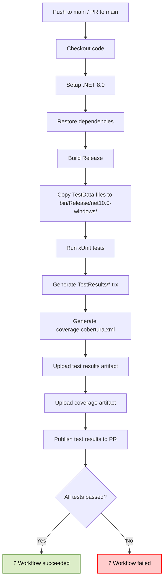

# GitHub Actions ワークフロー構成ガイド

## ワークフロー: Build and Test

このドキュメントは、`.github/workflows/build-and-test.yml` で定義された GitHub Actions ワークフローの詳細説明です。

---

## ?? 概要

| 項目 | 内容 |
|-----|------|
| **ワークフロー名** | Build and Test |
| **トリガー** | `main` ブランチへの push または pull request |
| **実行環境** | `windows-latest` (Windows Server 2022) |
| **対象言語** | C# (.NET 8.0) |
| **テストフレームワーク** | xUnit |
| **ビルド構成** | Release |

---

## ?? ワークフロー構成詳細

### トリガー条件

```yaml
on:
  push:
    branches: [ main ]
  pull_request:
    branches: [ main ]
```

**発動条件:**
- ? `main` ブランチへの push
- ? `main` ブランチへの pull request 作成・更新
- ? `test/v1.0.0` など他のブランチへの push では発動しない

---

### ジョブ構成: build

#### ステップ 1: コードのチェックアウト

```yaml
- name: Checkout code
  uses: actions/checkout@v4
```

**役割:** リポジトリのコードを GitHub Actions ランナーにダウンロード

**出力:** ワーキングディレクトリ (`${{ github.workspace }}`) にプロジェクト全体が配置される

---

#### ステップ 2: .NET 8.0 のセットアップ

```yaml
- name: Setup .NET 8.0
  uses: actions/setup-dotnet@v4
  with:
    dotnet-version: '8.0.x'
```

**役割:** Windows ランナーに .NET SDK 8.0.x をインストール

**ポイント:**
- `8.0.x` は最新の 8.0 パッチバージョンを自動選択
- Windows Forms アプリのため、Windows 環境必須
- プロジェクトは `net10.0-windows` をターゲットしていますが、GitHub Actions の制限により .NET 8.0 を使用しています

**注意:** 本番運用時に .NET 10 が GitHub Actions で完全サポートされた場合は、`dotnet-version: '10.0.x'` に更新してください。

---

#### ステップ 3: 依存関係の復元

```yaml
- name: Restore dependencies
  run: dotnet restore
```

**役割:** NuGet パッケージを復元

**処理内容:**
- `ConstantManager.csproj` の依存パッケージ（Windows Forms など）
- `ConstantManager.Tests.csproj` のテストパッケージ（xUnit 9.3.3 など）
- TestDataGenerator（存在する場合）

**出力:** `~/.nuget/packages/` にパッケージがキャッシュされる

---

#### ステップ 4: ビルド

```yaml
- name: Build
  run: dotnet build --configuration Release --no-restore
```

**役割:** ソリューション全体をビルド

**オプション説明:**
- `--configuration Release`: リリース構成でビルド（最適化有効）
- `--no-restore`: 先のステップで既に復元済みのため、復元をスキップして高速化

**出力:** 
- `bin/Release/net10.0-windows/` に DLL やテスト実行ファイルが生成
- **テストデータ**: `.csproj` の `CopyToOutputDirectory` 設定に従い、`TestData/*.csv` ファイルが `bin/Release/net10.0-windows/` にコピーされる

**テストデータのコピー確認:**
```
ConstantManager.Tests/bin/Release/net10.0-windows/
├── TestData/
│   ├── it_error_header.csv
│   ├── it_merge_new.csv
│   ├── it_perf_1000.csv
│   ├── it_readonly.csv
│   ├── it_replace_full.csv
│   ├── it_valid_initial.csv
│   ├── ut_empty.csv
│   ├── ut_invalid_encoding.csv
│   └── [その他のCSVファイル]
└── [実行ファイル]
```

---

#### ステップ 5: テスト実行

```yaml
- name: Run unit tests
  run: dotnet test --configuration Release --no-build --verbosity normal --logger "console;verbosity=normal" --collect:"XPlat Code Coverage"
```

**役割:** xUnit テストを実行

**オプション説明:**
- `--configuration Release`: リリース構成のテストを実行
- `--no-build`: ビルド済みのため、ビルドをスキップ
- `--verbosity normal`: 標準的な詳細度でログ出力
- `--logger "console;verbosity=normal"`: コンソール出力でテスト結果を表示
- `--collect:"XPlat Code Coverage"`: クロスプラットフォーム対応のコード カバレッジを収集

**テスト実行時のテストデータアクセス:**
- テストコード内で相対パス `TestData/*.csv` を使用する場合、実行ディレクトリは `bin/Release/net10.0-windows/` になります
- **推奨**: テストコード内では絶対パスまたは動的パス解決を使用してください

**テストコード例（推奨）:**
```csharp
// テストデータパスの動的解決
string testDataDir = Path.Combine(
    AppContext.BaseDirectory, 
    "TestData"
);
string csvPath = Path.Combine(testDataDir, "it_valid_initial.csv");
```

**出力:**
- コンソール: テスト結果サマリー（成功・失敗数）
- ファイル: `TestResults/*.trx` (テスト実行ログ, XML 形式)
- ファイル: `coverage.cobertura.xml` (コード カバレッジレポート)

---

#### ステップ 6: テスト結果のアップロード

```yaml
- name: Upload test results
  if: always()
  uses: actions/upload-artifact@v4
  with:
    name: test-results
    path: '**/TestResults/'
```

**役割:** テスト実行ログを GitHub Actions の成果物として保存

**条件:**
- `if: always()`: テスト成功・失敗に関わらず常に実行

**保存場所:** GitHub Actions UI の「Artifacts」タブで確認可能
- 保持期間：デフォルト 90 日間

---

#### ステップ 7: カバレッジレポートのアップロード

```yaml
- name: Upload coverage reports
  if: always()
  uses: actions/upload-artifact@v4
  with:
    name: coverage-reports
    path: '**/coverage.cobertura.xml'
```

**役割:** コード カバレッジレポートを GitHub Actions の成果物として保存

**用途:**
- ローカルで詳細な分析
- CI/CD パイプラインでのカバレッジ品質ゲート

---

#### ステップ 8: テスト結果のパブリッシュ

```yaml
- name: Publish test results
  if: always()
  uses: EnricoMi/publish-unit-test-result-action@v2
  with:
    files: '**/TestResults/*.trx'
    check_name: 'Test Results'
```

**役割:** テスト結果を GitHub UI に統合表示

**表示内容:**
- Pull Request チェック結果タブに「Test Results」として表示
- テスト成功・失敗数のサマリー
- 各テストケースの個別結果

**例（PR チェック表示）:**
```
? Test Results
   Passed: 28 / 28
```

または

```
? Test Results
   Passed: 27 / 28
   Failed: 1
   - ConstantManager.Tests.ValidationServiceTests.UT_VS_07_LogicalName_Invalid_Empty
```

---

## ?? 実行フロー図



---

## ?? テストデータの管理

### 現在のテストデータファイル

| ファイル名 | 用途 | テストケース |
|-----------|------|-----------|
| `it_error_header.csv` | ヘッダーエラー検証 | 統合テスト |
| `it_merge_new.csv` | マージモード検証 | 統合テスト |
| `it_perf_1000.csv` | パフォーマンス測定（1000行） | 統合テスト |
| `it_readonly.csv` | 読み取り専用ファイル | 統合テスト |
| `it_replace_full.csv` | 置換モード検証 | 統合テスト |
| `it_valid_initial.csv` | 正常系データ | 統合テスト |
| `ut_empty.csv` | 空ファイル検証 | ユニットテスト |
| `ut_invalid_encoding.csv` | エンコーディング検証 | ユニットテスト |

### ビルド時のコピー設定

`.csproj` の設定:
```xml
<ItemGroup>
  <None Update="TestData\it_error_header.csv">
    <CopyToOutputDirectory>PreserveNewest</CopyToOutputDirectory>
  </None>
  <!-- 他のファイルも同様 -->
</ItemGroup>
```

**効果:**
- ビルド時に `TestData/` 内のすべてのファイルが出力ディレクトリにコピーされる
- ローカルビルド、GitHub Actions ビルド両方で自動的に対応

---

## ?? ローカルでの同等実行

ワークフローと同じ条件でローカルテストを実行するコマンド:

```powershell
# PowerShell

# 1. 依存関係の復元
dotnet restore

# 2. Release 構成でビルド
dotnet build --configuration Release

# 3. テスト実行（カバレッジ収集）
dotnet test --configuration Release --no-build `
  --verbosity normal `
  --logger "console;verbosity=normal" `
  --collect:"XPlat Code Coverage"

# 4. テスト結果ファイルの確認
Get-ChildItem -Path "TestResults/" -Recurse -Filter "*.trx"
Get-ChildItem -Path "**\coverage.cobertura.xml" -Recurse
```

---

## ?? トラブルシューティング

### 問題: テストがテストデータファイルを見つけられない

**症状:**
```
FileNotFoundExceptionが発生
TestData/it_valid_initial.csv: そのようなファイルまたはディレクトリはありません
```

**原因:**
- テストコード内で相対パスが実行ディレクトリと異なっている

**解決策:**
```csharp
// ? 推奨されない方法
var path = "TestData/it_valid_initial.csv";

// ? 推奨される方法
var path = Path.Combine(AppContext.BaseDirectory, "TestData", "it_valid_initial.csv");
```

---

### 問題: ワークフローが .NET 8.0 で実行されている

**症状:**
```
Targeting framework: net8.0-windows
```

**背景:**
GitHub Actions のランナーが .NET 10.x をサポートするまでの暫定対応です。

**解決策（将来）:**
`.github/workflows/build-and-test.yml` の以下の行を更新:
```yaml
- name: Setup .NET
  uses: actions/setup-dotnet@v4
  with:
    dotnet-version: '10.0.x'  # 8.0.x から変更
```

---

### 問題: PR チェックで「Test Results」が表示されない

**症状:**
```
EnricoMi/publish-unit-test-result-action が動作していない
```

**原因:**
- `publish-unit-test-result-action` が古い可能性
- テスト結果ファイル `.trx` が生成されていない

**確認:**
1. ワークフロー実行ログで `dotnet test` のステップを確認
2. `TestResults/` ディレクトリが生成されているか確認
3. `.trx` ファイルがアップロード成果物に含まれているか確認

---

## ?? 今後の拡張案

### 1. コード品質ゲート

```yaml
- name: Check code coverage threshold
  run: |
    # カバレッジが 80% 以上か確認
    # coverlet レポートをパースして検証
```

### 2. コード分析（SonarQube など）

```yaml
- name: SonarQube scan
  uses: SonarSource/sonarcloud-github-action@master
```

### 3. 自動リリース

```yaml
- name: Create GitHub Release
  if: success()
  uses: actions/create-release@v1
```

### 4. Slack 通知

```yaml
- name: Notify Slack
  if: always()
  uses: slackapi/slack-github-action@v1
```

---

## ?? 参考リンク

- [GitHub Actions Documentation](https://docs.github.com/en/actions)
- [actions/checkout](https://github.com/actions/checkout)
- [actions/setup-dotnet](https://github.com/actions/setup-dotnet)
- [xUnit.net](https://xunit.net/)
- [Coverlet](https://github.com/coverlet-coverage/coverlet)
- [EnricoMi/publish-unit-test-result-action](https://github.com/EnricoMi/publish-unit-test-result-action)

---

**ドキュメント作成日:** 2026-01-21  
**対応ワークフロー:** `.github/workflows/build-and-test.yml` v1.0
