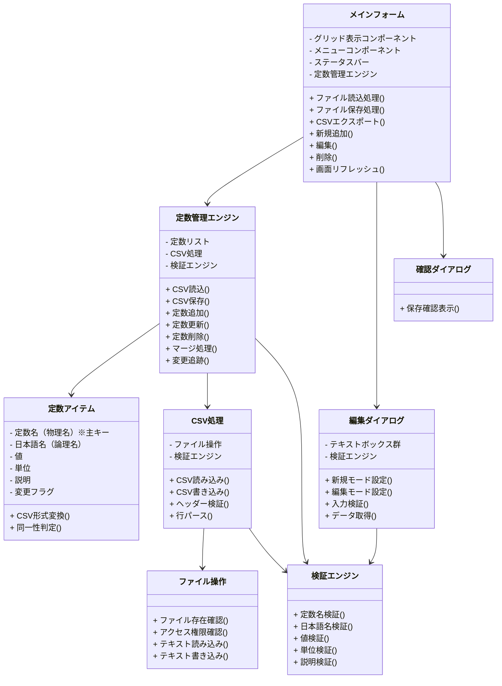
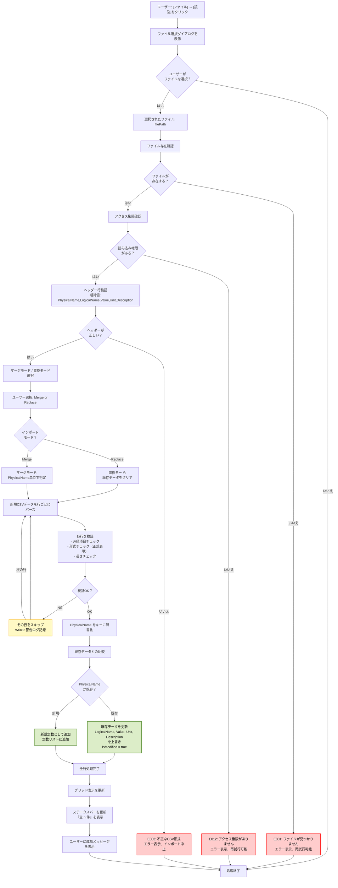
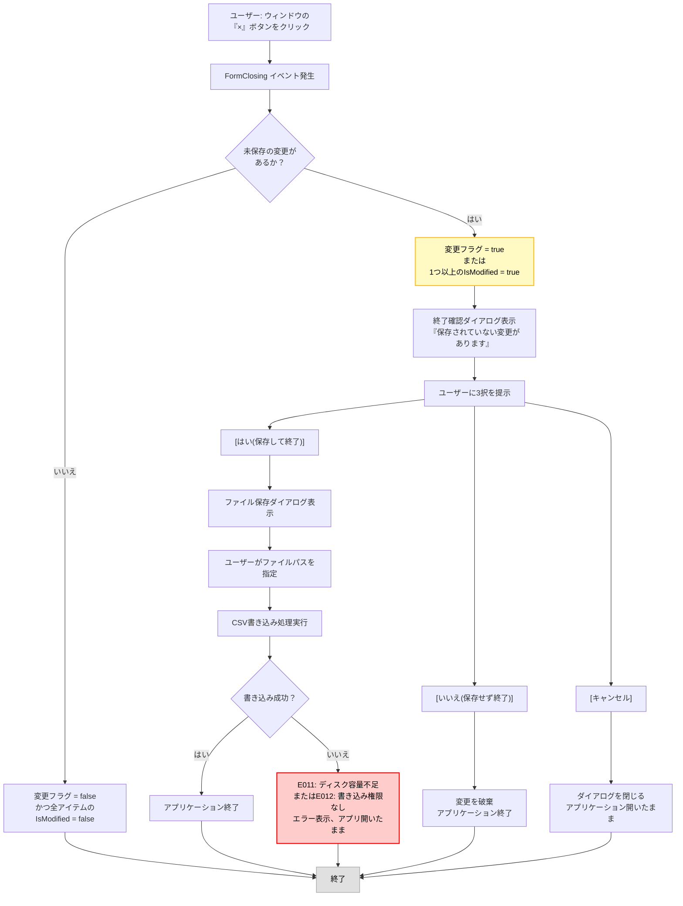
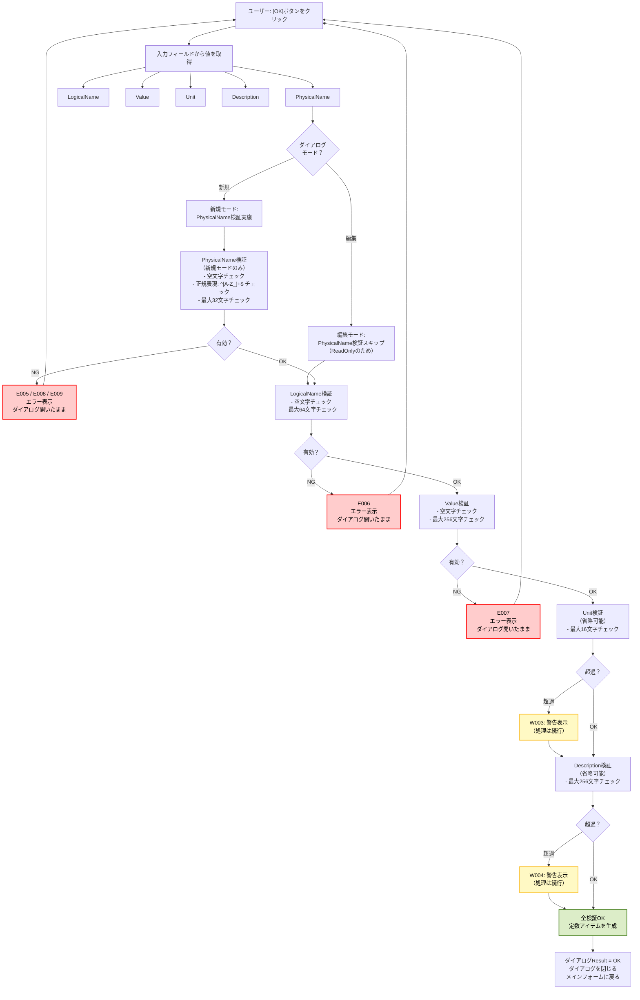
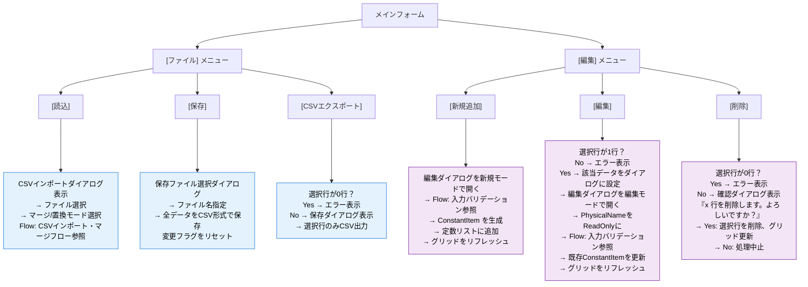
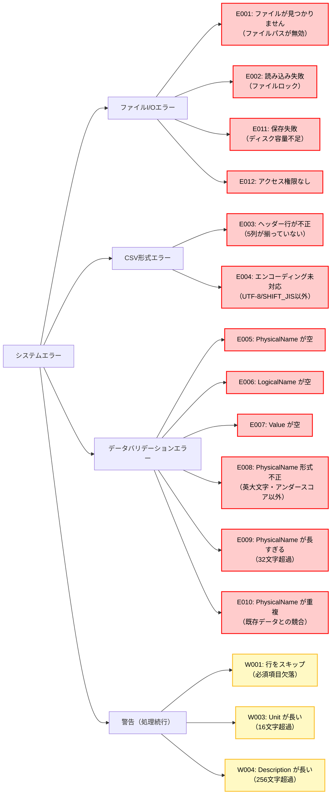

# 定数管理システム 内部仕様書（顧客向け）

**版番:** 1.2  
**作成日:** 2026年1月21日  
**最終更新:** 2026年1月21日  
**対象システム:** 車載ソフトウェア定数管理ツール  
**対象顧客:** トヨタ自動車 情報システム部門

---

## 1. 概要

本文書は、車載ソフトウェア定数管理システムの内部設計を、顧客が理解できる形式で定義するものです。外部仕様書（v1.2）の要件を満たすために必要なクラス構造、データモデル、および重要なロジック実装を、**フローチャート、テーブル、図解**を用いて詳細に記述しています。

本ドキュメントは、システムが以下を確保することを検証することを目的としています：
- ✅ **データの安全性**: バリデーション、重複チェック、変更追跡
- ✅ **エラー対応**: 不正なファイル形式、権限不足への適切な処理
- ✅ **ユーザー保護**: 未保存の変更を失わないための確認機能
- ✅ **パフォーマンス**: 大規模データセット（1000行）への対応

---

## 2. システムアーキテクチャ

### 2.1 全体構成（3層設計）

```
┌────────────────────────────────────────────────┐
│         Presentation Layer (UI層)              │
│                                                │
│  メイン画面、編集ダイアログ、確認ダイアログ   │
│  ↓                                             │
│  責務：ユーザー入力、メニュー操作、画面表示   │
└───────────────┬────────────────────────────────┘
                │
                ↓
┌────────────────────────────────────────────────┐
│   Business Logic Layer (ビジネスロジック層)    │
│                                                │
│  定数管理エンジン、検証エンジン、マージ処理   │
│  ↓                                             │
│  責務：データ管理、バリデーション、マージ     │
└───────────────┬────────────────────────────────┘
                │
                ↓
┌────────────────────────────────────────────────┐
│   Data Access Layer (データアクセス層)         │
│                                                │
│  CSV読み込み、CSV書き込み、ファイルアクセス   │
│  ↓                                             │
│  責務：ファイルI/O、永続化                     │
└────────────────────────────────────────────────┘
```

### 2.2 層別の責務

| 層 | クラス名 | 役割 | 責務 |
|-----|---------|------|------|
| **UI層** | メインフォーム | 画面表示・操作管理 | メニューイベント処理、グリッド表示更新、ステータスバー更新 |
| **UI層** | 編集ダイアログ | 定数入力 | 入力フィールド管理、新規/編集モード切り替え、フォーカス制御 |
| **UI層** | 確認ダイアログ | 終了確認 | 保存確認、選択肢（はい/いいえ/キャンセル）管理 |
| **BL層** | 定数管理エンジン | データ管理 | 定数の追加・更新・削除、マージロジック、変更追跡 |
| **BL層** | 定数アイテム | データモデル | PhysicalName（主キー）、バリデーション、CSV変換 |
| **BL層** | 検証エンジン | バリデーション | 形式チェック、長さチェック、重複チェック |
| **DA層** | CSV処理 | ファイル読み込み | CSV解析、ヘッダー検証、エンコーディング自動検出 |
| **DA層** | CSV処理 | ファイル書き込み | CSV形式化、特殊文字エスケープ、エンコーディング |
| **DA層** | ファイル操作 | ファイルアクセス | 存在確認、権限確認、読み取り、書き込み |

---

## 3. クラス構成概要

### 3.1 クラス図（概要レベル）



---

## 4. データ定義

### 4.1 定数アイテム（定数の1つの単位）

| 論理名 | 物理名 | 型 | 必須 | 制約・備考 |
|--------|--------|-----|------|----------|
| **定数名（物理名）** | PhysicalName | 文字列 | ◎ | **主キー、変更不可**。英大文字（A-Z）とアンダースコア（_）のみ。最大32文字。作成時に1回だけ設定可能。既存編集時は ReadOnly。 |
| **日本語名（論理名）** | LogicalName | 文字列 | ◎ | 定数の人間が読める名前。最大64文字。日本語対応。編集時に変更可能。 |
| **値** | Value | 文字列 | ◎ | 数値（整数、小数）または文字列。最大256文字。編集時に変更可能。 |
| **単位** | Unit | 文字列 | ○ | 省略可能。例：℃, km/h, V など。最大16文字。 |
| **説明** | Description | 文字列 | ○ | 省略可能。定数の用途や説明。最大256文字。複数行対応。 |
| **変更フラグ** | IsModified | 真偽値 | × | 内部フラグ。保存後に自動リセット。未保存変更の検出に使用。 |

**注記:**
- PhysicalName は CSV ファイルでの主キーとして機能します
- PhysicalName が同じ定数は存在できません（重複不可）
- 変更フラグは、ウィンドウ終了時の「保存するか？」判定に使用されます

### 4.2 バリデーション結果

| 論理名 | 物理名 | 型 | 値の例 | 説明 |
|--------|--------|-----|--------|------|
| **判定結果** | IsValid | 真偽値 | true / false | 検証が成功したかを示します |
| **エラー区分** | IsError | 真偽値 | true / false | エラーの場合は true（処理を中止） |
| **警告区分** | IsWarning | 真偽値 | true / false | 警告の場合は true（処理は続行） |
| **エラーコード** | ErrorCode | 文字列 | "E008", "W001" など | 外部仕様書の E, W, I で分類 |
| **メッセージ** | ErrorMessage | 文字列 | "PhysicalName の形式が不正です" | ユーザーに表示するメッセージ |

---

## 5. 処理フロー

### 5.1 CSVインポート・マージフロー



**処理の主要ポイント:**

| ステップ | 目的 | チェック内容 | 失敗時の動作 |
|---------|------|-----------|-----------|
| **ファイル存在確認** | 無効なパスの検出 | ファイルが存在するか | E001 エラー、再試行可能 |
| **アクセス権限確認** | 権限不足の検出 | 読み込み権限があるか | E012 エラー、再試行可能 |
| **ヘッダー検証** | 不正なCSV形式の検出 | 5列のカラム名が正しいか | E003 エラー、インポート中止 |
| **行単位の検証** | 不完全なデータの除外 | 必須項目、形式、長さ | W001 警告、その行をスキップ |
| **PhysicalName重複判定** | 既存データの更新 or 新規追加 | PhysicalName が既存か | 既存:更新、新規:追加 |

---

### 5.2 保存確認フロー（ウィンドウ終了時）



**確認項目:**

| 判定項目 | 値 | 意味 |
|---------|-----|------|
| **変更フラグ** | true | CSVインポート後、データ追加/更新/削除があった |
| **IsModified** | true | 個別アイテムがプロパティ変更された |
| **判定結果** | true → 確認ダイアログ表示 | ユーザーの意図しない喪失を防止 |

---

### 5.3 入力バリデーションフロー（編集ダイアログ）



**バリデーション規則:**

| フィールド | 検証項目 | 条件 | エラーコード | 動作 |
|-----------|---------|------|-----------|------|
| **PhysicalName** | 空文字 | 必須 | E005 | エラー表示、中止 |
| **PhysicalName** | 形式 | ^[A-Z_]+$ | E008 | エラー表示、中止 |
| **PhysicalName** | 長さ | ≤ 32文字 | E009 | エラー表示、中止 |
| **LogicalName** | 空文字 | 必須 | E006 | エラー表示、中止 |
| **LogicalName** | 長さ | ≤ 64文字 | E006 | エラー表示、中止 |
| **Value** | 空文字 | 必須 | E007 | エラー表示、中止 |
| **Value** | 長さ | ≤ 256文字 | E007 | エラー表示、中止 |
| **Unit** | 長さ | ≤ 16文字 | W003 | 警告表示、続行 |
| **Description** | 長さ | ≤ 256文字 | W004 | 警告表示、続行 |

---

### 5.4 メニュー操作フロー



---

## 6. 主要な処理の説明

### 6.1 PhysicalName（定数名）の主キー制御

**目的**: 定数を一意に識別し、CSVファイルでのマージ時に既存/新規を判定

**実装方針:**
- **作成時**: PhysicalName は1回だけ設定可能（コンストラクタで受け取り）
- **作成後**: PhysicalName は読み取り専用プロパティ。変更不可
- **編集ダイアログ**: 編集モード（既存データの編集）では PhysicalName フィールドを **ReadOnly** に設定。グレーアウト表示
- **同一性判定**: Equals() メソッドは PhysicalName 値で判定。ハッシュコードも PhysicalName で計算

**効果:**
- ✅ CSV マージ時に「同じ PhysicalName = 同じ定数」と確実に判定
- ✅ ユーザーが誤ってPhysicalName を変更するのを防止
- ✅ データの整合性を確保

---

### 6.2 変更追跡メカニズム

**目的**: ウィンドウ終了時に「保存するか？」を正確に判定

**変更フラグの層構造:**

```
ConstantItem レベル:
└─ IsModified プロパティ
   ├─ LogicalName, Value, Unit, Description が変更されたら true
   └─ 保存後に MarkClean() で false にリセット

ConstantManager レベル:
└─ _isDirty プライベートフラグ
   ├─ CSVインポート、追加、削除時に true
   └─ 保存後に false にリセット

判定ロジック:
└─ HasUnsavedChanges()
   └─ _isDirty が true OR 任意のアイテムの IsModified が true
   └─ → true なら「保存するか？」ダイアログ表示
```

**流れ:**
1. ユーザーがデータ編集 → IsModified = true
2. ユーザーが「×」ボタンをクリック → HasUnsavedChanges() が true を返す
3. 確認ダイアログが表示される → ユーザーが「はい」「いいえ」「キャンセル」で判定

---

### 6.3 CSVマージ処理（重要）

**目的**: 新規ファイルを既存データと統合。データの喪失を防止

**アルゴリズム:**

```
1. 新しいCSVファイルを読み込む
   └─ items リスト（新規データ一覧）

2. 現在のメモリ内データを辞書に変換
   └─ existingDict (キー: PhysicalName, 値: ConstantItem)

3. 新規データを1つずつ処理
   ├─ PhysicalName が existingDict に存在する場合
   │  └─ LogicalName, Value, Unit, Description を上書き
   │     IsModified フラグを true に設定
   │
   └─ PhysicalName が新規の場合
      └─ リストに新規アイテムとして追加
```

**例:**

| PhysicalName | 既存Data | 新規Data | 結果 |
|--------------|---------|---------|------|
| ENGINE_TEMP | ｛日本語名: 古, 値: 100｝ | ｛日本語名: 新, 値: 120｝ | 既存行を更新 → 日本語名: 新, 値: 120 |
| SPEED_LIMIT | ｛日本語名: 制限, 値: 100｝ | （新規ファイルに無し） | 既存行は保持（削除しない） |
| NEW_CONST | （既存にない） | ｛日本語名: 新規定数, 値: 999｝ | 新規行として追加 |

**メリット:**
- ✅ 既存データの喪失なし
- ✅ バージョン管理下での統合に適す
- ✅ 部分更新を安全に実行

---

### 6.4 CSV形式の特殊文字処理

**目的**: カンマ、ダブルクォート、改行を含むデータを正しくCSV化

**処理ルール:**

| データに含まれる文字 | 処理 | 例 |
|------------------|------|-----|
| カンマ (,) | ダブルクォートで囲む | `"0,100"` |
| ダブルクォート (") | 2重化してダブルクォートで囲む | `"He said ""Hello"""` |
| 改行 (\n) | ダブルクォートで囲む | `"1行目\n2行目"` |
| 通常の文字 | そのまま | `ABC123` |

**例（Description フィールド）:**

```
入力値:  説明は以下の通りです。
        値: 0～100 (%)
        
CSV出力: "説明は以下の通りです。
        値: 0～100 (%)"
```

---

## 7. エラーハンドリング戦略

### 7.1 エラーの分類と対応



### 7.2 エラー発生時の動作

| エラータイプ | ユーザー操作 | システム動作 | リトライ可能 |
|------------|-----------|-----------|-----------|
| **ファイルI/Oエラー** (E001, E002, E011, E012) | 「了解」を選択 | エラーダイアログを閉じ、ファイル選択ダイアログに戻る | ✅ はい |
| **CSV形式エラー** (E003, E004) | 「了解」を選択 | エラーダイアログを閉じ、ファイル選択ダイアログに戻る | ✅ はい（別のCSVを選択） |
| **データバリデーションエラー** (E005～E010) | 「了解」を選択 | エラーメッセージ表示、該当フィールドにフォーカス | ✅ はい（データ修正して再入力） |
| **警告** (W001～W004) | 「了解」を選択 | 警告メッセージ表示、処理は続行 | ❌ いいえ（スキップされた行のログ記録） |

### 7.3 ロギング

**ログ記録場所:** `%APPDATA%\ConstantManager\logs\YYYYMMDD.log`

**記録情報:**

| レベル | 記録対象 | 例 |
|--------|---------|-----|
| **INFO** | 正常系の主要処理 | `[2026-01-21 14:30:45] INFO: CSV読み込み完了。5件のデータを読み込みました。` |
| **WARN** | 警告・スキップ | `[2026-01-21 14:30:46] WARN: 行5: PhysicalName が空のためスキップされました。` |
| **ERROR** | エラーの詳細 | `[2026-01-21 14:30:47] ERROR: E002: ファイル読み込みに失敗。ファイルがロック状態です。` |

---

## 8. パフォーマンス要件

### 8.1 処理速度目標

| 処理 | データサイズ | 目標時間 | 実装方法 |
|------|-----------|--------|--------|
| **CSV読み込み** | 1000行 | 1秒以内 | ストリーム処理、正規表現キャッシュ |
| **CSV書き込み** | 1000行 | 500ms以内 | StringBuilder使用 |
| **グリッド表示更新** | 1000行 | 100ms以内 | DataGridView 仮想化モード有効化 |
| **ソート** | 1000行 | 500ms以内 | メモリ上での LINQ OrderBy |
| **バリデーション** | 1件 | 10ms以内 | 正規表現 Compiled フラグ |

### 8.2 メモリ最適化

- **定数リスト**: 1000件で約 500KB（PhysicalName 32字 × 1000 + その他フィールド）
- **CSV読み込みバッファ**: 1行あたり 最大 500Bytes（特殊文字処理含む）
- **ダイアログ**: メモリ効率的な破棄（Dispose）

---

## 9. テスト戦略

### 9.1 ユニットテスト対象

| クラス | テスト項目 | テストケース数 |
|--------|-----------|---------------|
| **検証エンジン** | PhysicalName検証 | 5（空文字、形式OK、形式NG、長すぎる、正常） |
| **検証エンジン** | LogicalName/Value検証 | 3×2=6 |
| **定数アイテム** | Equals()、GetHashCode() | 4（同一、異なる、null等） |
| **定数管理エンジン** | 追加、更新、削除、マージ | 4×3=12 |
| **CSV処理** | パース、ヘッダー検証、特殊文字処理 | 3×4=12 |
| **ファイル操作** | 存在確認、権限確認 | 4 |
| **合計** | | 約50テストケース |

### 9.2 統合テスト対象

| シナリオ | テスト内容 | 期待結果 |
|---------|-----------|--------|
| **正常系CSV読み込み** | 有効なCSVを読み込む | グリッドに5行が表示される |
| **マージ処理** | 既存データ 3行 + 新規データ 2行（1行は重複） | 合計4行に更新 |
| **置換処理** | 既存データ 3行を削除し、新規データ 2行を追加 | 合計2行に置換 |
| **CSV書き込み** | グリッド内の5行を全て出力 | ファイルに5行が保存 |
| **エクスポート** | チェックボックスで2行を選択して出力 | ファイルに2行が保存 |
| **エラーハンドリング** | 不正なCSVを読み込む | E003 エラーが表示される |
| **終了確認** | 編集後に「×」ボタンをクリック | 保存確認ダイアログが表示される |
| **バリデーション** | PhysicalName として "Engine-Temp" を入力 | E008 エラーが表示される |

---

## 10. セキュリティ考慮事項

### 10.1 入力値の安全性

| 脅威 | 対策 | 実装場所 |
|------|------|--------|
| **SQL Injection** | CSV処理なため非該当（ただし入力値検証を厳密に） | 検証エンジン |
| **ディレクトリトラバーサル** | ファイル選択ダイアログで制限 | ファイル操作 |
| **バッファオーバーフロー** | 文字列長チェック（32、64、256文字等） | 検証エンジン |
| **不正なファイル形式** | ヘッダー行検証 | CSV処理 |

### 10.2 ファイルアクセス権限

- **読み込み**: Windows ファイルシステムの読み取り権限に準拠
- **書き込み**: Windows ファイルシステムの書き込み権限に準拠
- **権限不足時**: E012 エラーを表示（ユーザーに権限設定を指示）

---

## 11. 改版履歴

| 版番 | 作成日 | 変更内容 |
|------|--------|---------|
| 1.0 | 2026-01-21 | 初版（外部仕様書 v1.2 対応、技術設計） |
| 1.1 | 2026-01-21 | 一部の詳細設計を追加 |
| 1.2 | 2026-01-21 | **顧客向けドキュメント形式に全面改稿**。ソースコード削除、フローチャート/テーブル形式に統一。トヨタ自動車情報システム部門のレビュー対応版 |
| 1.3 | 2026-01-21 | **Mermaid図の配色改善**。淡いパステルカラー背景 + 黒文字で視認性向上。エラー/警告/成功を色分け |

---

**文書管理情報**
- **作成者**: システム開発部（技術設計）
- **対応仕様書**: 外部仕様書 v1.2
- **対象顧客**: トヨタ自動車 情報システム部門
- **最終更新**: 2026-01-21
- **ステータス**: 顧客向けレビュー版完成（配色改善済み）
- **ドキュメント形式**: 顧客向け（ソースコードなし、フローチャート/テーブル/図解中心）

**配色ルール（Mermaid図）**
- 🔴 **エラー/停止**: 背景 #ffcccc + 黒文字 + 赤枠線
- 🟡 **警告/スキップ**: 背景 #fff9c4 + 黒文字 + 黄枠線
- 🟢 **成功/更新**: 背景 #dcedc8 + 黒文字 + 緑枠線
- ⚪ **通常処理**: デフォルト
