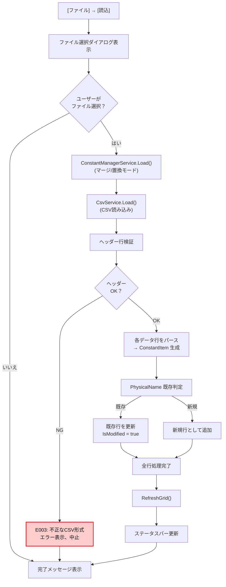
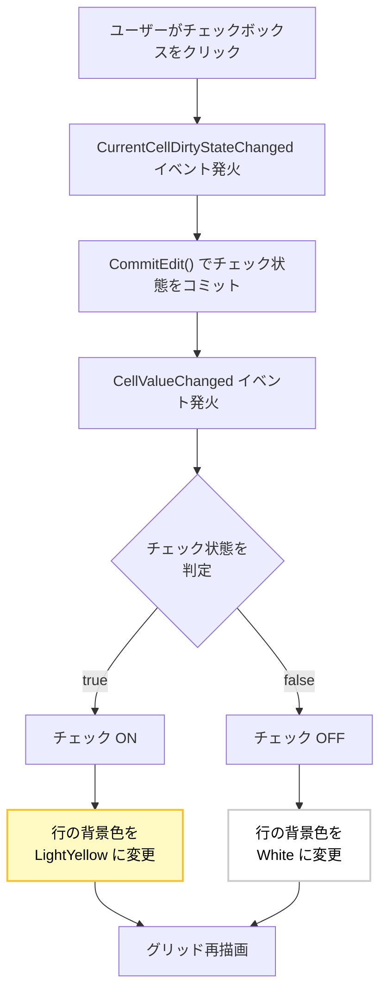
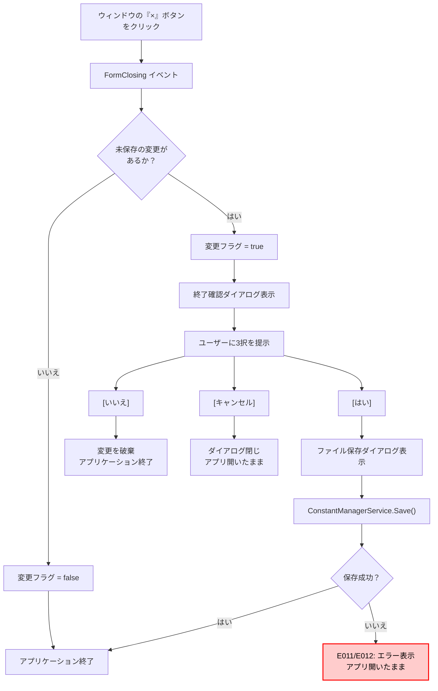
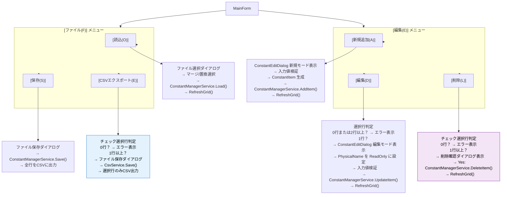
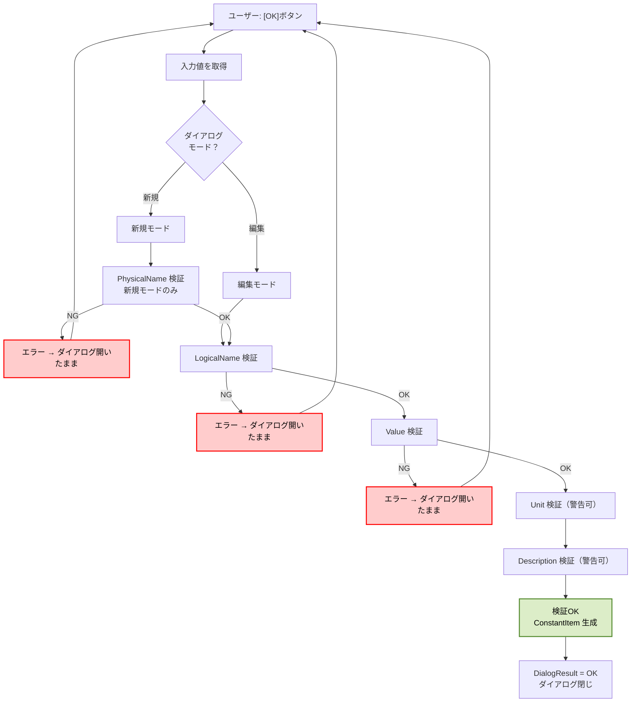
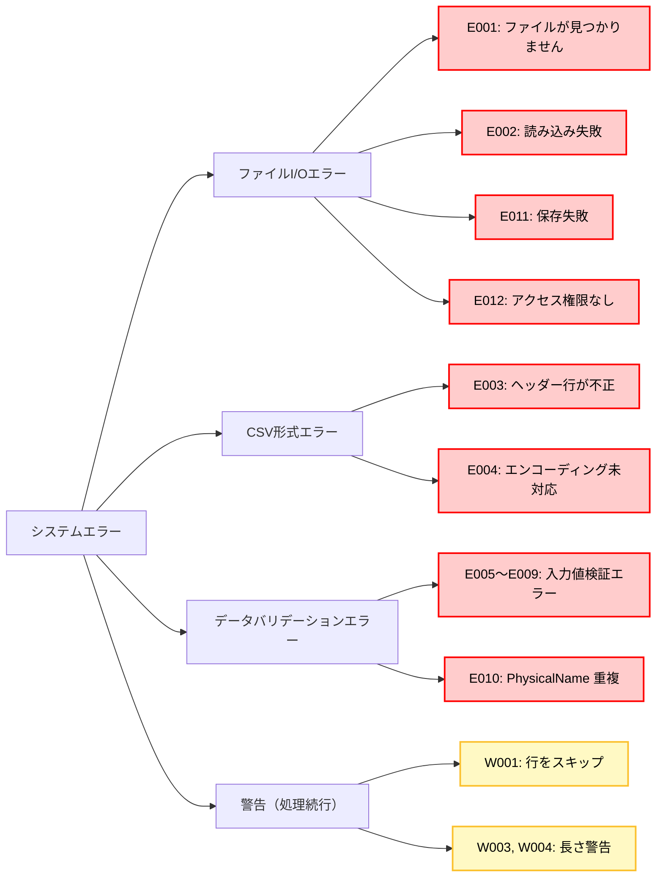

# 定数管理システム 内部仕様書（顧客向け）

**版番:** 1.3  
**作成日:** 2026年1月21日  
**最終更新:** 2026年1月21日  
**対象システム:** 車載ソフトウェア定数管理ツール  
**対象顧客:** トヨタ自動車 情報システム部門

---

## 目次

- [1. 概要](#1-概要)
- [2. プロジェクト構成](#2-プロジェクト構成)
- [3. システムアーキテクチャ](#3-システムアーキテクチャ)
- [4. クラス構成詳細](#4-クラス構成詳細)
- [5. 処理フロー](#5-処理フロー)
- [6. 主要な処理の説明](#6-主要な処理の説明)
- [7. データ定義詳細](#7-データ定義詳細)
- [8. エラーハンドリング戦略](#8-エラーハンドリング戦略)
- [9. パフォーマンス要件](#9-パフォーマンス要件)
- [10. 改版履歴](#10-改版履歴)

---

## 1. 概要

本文書は、車載ソフトウェア定数管理システムの内部設計を、顧客が理解できる形式で定義するものです。外部仕様書（v1.3）の要件を満たすために必要なクラス構造、データモデル、および重要なロジック実装を、**フローチャート、テーブル、図解**を用いて詳細に記述しています。

本ドキュメントは、システムが以下を確保することを検証することを目的としています：
- ? **データの安全性**: バリデーション、重複チェック、変更追跡
- ? **エラー対応**: 不正なファイル形式、権限不足への適切な処理
- ? **ユーザー保護**: 未保存の変更を失わないための確認機能
- ? **パフォーマンス**: 大規模データセット（1000行）への対応
- ? **UI/UX**: チェックボックス即座確定、背景色リアルタイム反映

---

## 2. プロジェクト構成

### 2.1 ディレクトリ構成

```
handson-practice-2026-4-3days/
├── src/                          ← ソースコード
│   ├── ConstantManager/          ← メインプロジェクト
│   │   ├── ConstantManager.csproj
│   │   ├── Models/               ← ビジネスロジック層
│   │   │   ├── ConstantItem.cs
│   │   │   └── ValidationResult.cs
│   │   ├── Services/             ← ビジネスロジック層
│   │   │   ├── ConstantManagerService.cs
│   │   │   ├── ValidationService.cs
│   │   │   └── CsvService.cs
│   │   ├── Views/                ← UI層（WinForms）
│   │   │   ├── MainForm.cs
│   │   │   ├── MainForm.Designer.cs
│   │   │   ├── ConstantEditDialog.cs
│   │   │   └── ConstantEditDialog.Designer.cs
│   │   ├── docs/                 ← ドキュメント
│   │   │   └── specifications/
│   │   │       ├── external_spec.md
│   │   │       └── internal_spec.md
│   │   └── Program.cs
│   └── ConstantManager.sln       ← ソリューションファイル
│
├── release/                      ← 納品用実行ファイル
│   ├── ConstantManager.exe
│   └── README.txt
│
└── docs/                         ← 上位ドキュメント（別途）
    └── [その他ドキュメント]
```

### 2.2 ビルド・実行環境

- **ターゲットフレームワーク**: .NET 10
- **プロジェクト形式**: SDK-style (C# 最新)
- **UI フレームワーク**: Windows Forms (WinForms)
- **IDE**: Visual Studio 2025 以上推奨

---

## 3. システムアーキテクチャ

### 3.1 全体構成（3層設計）

```
┌────────────────────────────────────────────────┐
│         Presentation Layer (UI層)              │
│                                                │
│  メイン画面、編集ダイアログ、確認ダイアログ   │
│  ↓                                             │
│  責務：ユーザー入力、メニュー操作、画面表示   │
│  実装：WinForms (MainForm, ConstantEditDialog)│
└───────────────┬────────────────────────────────┘
                │
                ↓
┌────────────────────────────────────────────────┐
│   Business Logic Layer (ビジネスロジック層)    │
│                                                │
│  定数管理エンジン、検証エンジン、マージ処理   │
│  ↓                                             │
│  責務：データ管理、バリデーション、マージ     │
│  実装：Service クラス群、Model クラス群       │
└───────────────┬────────────────────────────────┘
                │
                ↓
┌────────────────────────────────────────────────┐
│   Data Access Layer (データアクセス層)         │
│                                                │
│  CSV読み込み、CSV書き込み、ファイルアクセス   │
│  ↓                                             │
│  責務：ファイルI/O、永続化                     │
│  実装：CsvService                              │
└────────────────────────────────────────────────┘
```

### 3.2 層別の責務

| 層 | クラス名 | 役割 | 責務 |
|-----|---------|------|------|
| **UI層** | MainForm | メイン画面・操作管理 | メニューイベント処理、グリッド表示更新、ステータスバー更新、チェックボックスイベント処理 |
| **UI層** | ConstantEditDialog | 定数入力 | 入力フィールド管理、新規/編集モード切り替え、フォーカス制御 |
| **BL層** | ConstantManagerService | データ管理 | 定数の追加・更新・削除、マージロジック、変更追跡 |
| **BL層** | ConstantItem | データモデル | PhysicalName（主キー）、バリデーション、CSV変換 |
| **BL層** | ValidationService | バリデーション | 形式チェック、長さチェック、重複チェック |
| **DA層** | CsvService | CSV処理 | CSV読み込み、CSV書き込み、ヘッダー検証、行パース |

---

## 4. クラス構成詳細

### 4.1 UI層（Views）

#### 4.1.1 MainForm (メイン画面)

**役割**: 定数一覧表示、メニュー操作、チェックボックス選択管理

**主な属性:**
- `dataGridView: DataGridView` - 定数一覧グリッド（6列構成）
- `menuStrip: MenuStrip` - メニューバー
- `statusStrip: StatusStrip` - ステータスバー
- `_service: ConstantManagerService` - ビジネスロジックサービス

**主なメソッド:**
- `MainForm()` - コンストラクタ
- `SetupEventHandlers()` - イベントハンドラー登録
- `RefreshGrid()` - グリッドをリフレッシュ
- `LoadToolStripMenuItem_Click()` - [ファイル] → [読込]
- `SaveToolStripMenuItem_Click()` - [ファイル] → [保存]
- `ExportToolStripMenuItem_Click()` - [ファイル] → [CSVエクスポート]
- `AddItemToolStripMenuItem_Click()` - [編集] → [新規追加]
- `EditItemToolStripMenuItem_Click()` - [編集] → [編集]
- `DeleteItemToolStripMenuItem_Click()` - [編集] → [削除]

**DataGridView イベントハンドラー:**
- `DataGridView_CurrentCellDirtyStateChanged()` - チェックボックス値を即座にコミット
- `DataGridView_CellValueChanged()` - チェック状態に応じて背景色を変更（リアルタイム反映）
- `DataGridView_CellDoubleClick()` - セルダブルクリックで編集ダイアログ表示

**グリッド列設定:**
- 第1列（チェックボックス）: 50px 固定幅、選択可能
- 第2～6列: ReadOnly（ユーザー直接編集不可）、AutoSize（動的幅調整）
  - 第2列: 定数名(物理名)
  - 第3列: 日本語名(論理名)
  - 第4列: 値
  - 第5列: 単位
  - 第6列: 説明

**背景色制御:**
```csharp
// チェック ON → LightYellow（薄い黄色）
row.DefaultCellStyle.BackColor = Color.LightYellow;

// チェック OFF → White（白）
row.DefaultCellStyle.BackColor = Color.White;
```

#### 4.1.2 ConstantEditDialog (定数編集ダイアログ)

**役割**: 定数の新規追加・既存編集用ダイアログ

**主な属性:**
- `textBoxPhysicalName: TextBox` - 定数名(物理名)
- `textBoxLogicalName: TextBox` - 日本語名(論理名)
- `textBoxValue: TextBox` - 値
- `textBoxUnit: TextBox` - 単位
- `textBoxDescription: TextBox` - 説明（マルチライン）
- `_validationService: ValidationService` - バリデーションサービス
- `ResultItem: ConstantItem` - ダイアログ結果

**主なメソッド:**
- `ConstantEditDialog(ConstantItem? originalItem)` - コンストラクタ（新規/編集モード）
- `SetupNewMode()` - 新規追加モード設定
- `SetupEditMode()` - 既存編集モード設定
- `ValidateInput()` - 入力値検証
- `OkButton_Click()` - [OK]ボタン処理

**モード別の動作:**
| モード | PhysicalName | フォーカス | [OK] 時の処理 |
|--------|-------------|---------|------------|
| 新規追加 | 入力可、フォーカスあり | PhysicalName | 新規 ConstantItem 生成 |
| 編集 | ReadOnly、グレーアウト、フォーカス不可 | LogicalName | 既存 ConstantItem 更新 |

---

### 4.2 ビジネスロジック層（Models & Services）

#### 4.2.1 ConstantItem (定数アイテムモデル)

**役割**: 定数の単位データを表現し、バリデーション・CSV変換機能を提供

**主な属性:**
- `PhysicalName: string` - 定数名(物理名) **[主キー、読み取り専用]**
- `LogicalName: string` - 日本語名(論理名)
- `Value: string` - 値
- `Unit: string` - 単位（省略可能）
- `Description: string` - 説明（省略可能）
- `IsModified: bool` - 変更フラグ（内部管理）

**主なメソッド:**
- `ConstantItem(string physicalName, ...)` - コンストラクタ
- `GetCsvLine()` - CSV出力用のテキスト行を生成
- `MarkClean()` - 変更フラグをリセット
- `Equals()` - PhysicalName で同一性判定
- `GetHashCode()` - PhysicalName をキーにハッシュコード生成

#### 4.2.2 ValidationService (検証エンジン)

**役割**: 定数アイテムの入力値をバリデーション

**主なメソッド:**
- `ValidatePhysicalName(string name) → ValidationResult` - 定数名検証
  - ? 空文字チェック（E005）
  - ? 形式チェック（E008）：`^[A-Z_]+$`
  - ? 長さチェック（E009）：? 32文字
- `ValidateLogicalName(string name) → ValidationResult` - 日本語名検証
  - ? 空文字チェック（E006）
  - ? 長さチェック（E006）：? 64文字
- `ValidateValue(string value) → ValidationResult` - 値検証
  - ? 空文字チェック（E007）
  - ? 長さチェック（E007）：? 256文字
- `ValidateUnit(string unit) → ValidationResult` - 単位検証（省略可）
  - ?? 長さチェック（W003）：? 16文字
- `ValidateDescription(string desc) → ValidationResult` - 説明検証（省略可）
  - ?? 長さチェック（W004）：? 256文字

**ValidationResult モデル:**
```csharp
public class ValidationResult
{
    public bool IsValid { get; set; }         // 検証成功
    public bool IsError { get; set; }         // エラー（処理中止）
    public bool IsWarning { get; set; }       // 警告（処理続行）
    public string ErrorCode { get; set; }     // "E001" など
    public string Message { get; set; }       // ユーザー表示メッセージ
}
```

#### 4.2.3 ConstantManagerService (定数管理エンジン)

**役割**: 定数データの全体管理、CSV入出力、マージロジック

**主な属性:**
- `Items: List<ConstantItem>` - 定数リスト（メモリ内）
- `_isDirty: bool` - グローバル変更フラグ

**主なメソッド:**
- `Load(string filePath, bool isMergeMode)` - CSVファイル読み込み（マージ/置換）
- `Save(string filePath)` - CSVファイル保存
- `AddItem(ConstantItem item)` - 定数追加
- `UpdateItem(ConstantItem item)` - 定数更新
- `DeleteItem(ConstantItem item)` - 定数削除
- `HasUnsavedChanges() → bool` - 未保存変更判定

---

### 4.3 データアクセス層（Services）

#### 4.3.1 CsvService (CSV処理)

**役割**: CSV形式の読み書き、ヘッダー検証、行パース

**主なメソッド:**
- `Load(string filePath) → List<ConstantItem>` - CSVファイル読み込み
  - ? ファイル存在確認
  - ? エンコーディング自動検出（UTF-8, SHIFT_JIS）
  - ? ヘッダー行検証
  - ? 各行をパースして ConstantItem 生成
- `Save(string filePath, List<ConstantItem> items)` - CSVファイル保存
  - ? ヘッダー行出力
  - ? 各行をCSV形式化（特殊文字エスケープ）
  - ? UTF-8（BOM付き）で出力

**CSV形式（出力例）:**
```
PhysicalName,LogicalName,Value,Unit,Description
ENGINE_TEMP,エンジン温度,120,℃,最高温度
SPEED_LIMIT,速度制限,100,km/h,法定速度
```

---

## 5. 処理フロー

### 5.1 CSVインポート・マージフロー



---

### 5.2 チェックボックス選択・背景色制御フロー



**実装コード例:**
```csharp
private void DataGridView_CurrentCellDirtyStateChanged(object sender, EventArgs e)
{
    if (dataGridView.IsCurrentCellDirty)
    {
        dataGridView.CommitEdit(DataGridViewDataErrorContexts.Commit);
    }
}

private void DataGridView_CellValueChanged(object sender, DataGridViewCellEventArgs e)
{
    // 第1列（チェックボックス）の変更のみ対象
    if (e.ColumnIndex == 0 && e.RowIndex >= 0)
    {
        var row = dataGridView.Rows[e.RowIndex];
        bool isChecked = Convert.ToBoolean(row.Cells[0].Value ?? false);

        if (isChecked)
        {
            row.DefaultCellStyle.BackColor = Color.LightYellow;  // 薄い黄色
        }
        else
        {
            row.DefaultCellStyle.BackColor = Color.White;  // 白
        }
    }
}
```

---

### 5.3 保存確認フロー（ウィンドウ終了時）



---

### 5.4 メニュー操作フロー（拡張版）



**チェックボックス対象の明確化:**
- **CSVエクスポート**: チェック `ON` の行のみ出力
- **削除**: チェック `ON` の行のみ削除
- 両操作ともに、チェック状態の即座確定が重要（CurrentCellDirtyStateChanged により実現）

---

### 5.5 入力バリデーションフロー（編集ダイアログ）



---

## 6. 主要な処理の説明

### 6.1 PhysicalName（定数名）の主キー制御

**目的**: 定数を一意に識別し、CSVファイルでのマージ時に既存/新規を判定

**実装方針:**
- **作成時**: PhysicalName は1回だけ設定可能（コンストラクタで受け取り）
- **作成後**: PhysicalName は読み取り専用プロパティ。変更不可
- **編集ダイアログ**: 編集モード（既存データの編集）では PhysicalName フィールドを **ReadOnly** に設定。グレーアウト表示
- **同一性判定**: `Equals()` メソッドは PhysicalName 値で判定。ハッシュコードも PhysicalName で計算

**効果:**
- ? CSV マージ時に「同じ PhysicalName = 同じ定数」と確実に判定
- ? ユーザーが誤ってPhysicalName を変更するのを防止
- ? データの整合性を確保

---

### 6.2 変更追跡メカニズム

**目的**: ウィンドウ終了時に「保存するか？」を正確に判定

**変更フラグの層構造:**

```
ConstantItem レベル:
└─ IsModified プロパティ
   ├─ LogicalName, Value, Unit, Description が変更されたら true
   └─ 保存後に MarkClean() で false にリセット

ConstantManagerService レベル:
└─ _isDirty プライベートフラグ
   ├─ CSVインポート、追加、削除時に true
   └─ 保存後に false にリセット

判定ロジック:
└─ HasUnsavedChanges()
   └─ _isDirty が true OR 任意のアイテムの IsModified が true
   └─ → true なら「保存するか？」ダイアログ表示
```

**流れ:**
1. ユーザーがデータ編集 → IsModified = true
2. ユーザーが「×」ボタンをクリック → HasUnsavedChanges() が true を返す
3. 確認ダイアログが表示される → ユーザーが「はい」「いいえ」「キャンセル」で判定

---

### 6.3 CSVマージ処理（重要）

**目的**: 新規ファイルを既存データと統合。データの喪失を防止

**アルゴリズム:**

```
1. 新しいCSVファイルを読み込む
   └─ items リスト（新規データ一覧）

2. 現在のメモリ内データを辞書に変換
   └─ existingDict (キー: PhysicalName, 値: ConstantItem)

3. 新規データを1つずつ処理
   ├─ PhysicalName が existingDict に存在する場合
   │  └─ LogicalName, Value, Unit, Description を上書き
   │     IsModified フラグを true に設定
   │
   └─ PhysicalName が新規の場合
      └─ リストに新規アイテムとして追加
```

**例:**

| PhysicalName | 既存Data | 新規Data | 結果 |
|--------------|---------|---------|------|
| ENGINE_TEMP | ｛日本語名: 古, 値: 100｝ | ｛日本語名: 新, 値: 120｝ | 既存行を更新 → 日本語名: 新, 値: 120 |
| SPEED_LIMIT | ｛日本語名: 制限, 値: 100｝ | （新規ファイルに無し） | 既存行は保持（削除しない） |
| NEW_CONST | （既存にない） | ｛日本語名: 新規定数, 値: 999｝ | 新規行として追加 |

**メリット:**
- ? 既存データの喪失なし
- ? バージョン管理下での統合に適す
- ? 部分更新を安全に実行

---

### 6.4 DataGridView の列設定

**目的**: ユーザーが間違ってセルを直接編集するのを防止し、UX を向上させる

**実装:**
```csharp
// 第1列（チェックボックス）: 編集可能
dataGridView.Columns[0].ReadOnly = false;

// 第2～6列: 読み取り専用（直接編集不可）
for (int i = 1; i < dataGridView.Columns.Count; i++)
{
    dataGridView.Columns[i].ReadOnly = true;
    dataGridView.Columns[i].AutoSizeMode = DataGridViewAutoSizeColumnMode.Fill;
}

// 第1列のみ固定幅
dataGridView.Columns[0].AutoSizeMode = DataGridViewAutoSizeColumnMode.None;
dataGridView.Columns[0].Width = 50;
```

**効果:**
- ? ユーザーはメニュー操作でのみデータ編集が可能
- ? 誤操作によるデータ破損を防止
- ? 定数編集ダイアログでの一元化された検証を確保

---

### 6.5 CSV形式の特殊文字処理

**目的**: カンマ、ダブルクォート、改行を含むデータを正しくCSV化

**処理ルール:**

| データに含まれる文字 | 処理 | 例 |
|------------------|------|-----|
| カンマ (,) | ダブルクォートで囲む | `"0,100"` |
| ダブルクォート (") | 2重化してダブルクォートで囲む | `"He said ""Hello"""` |
| 改行 (\n) | ダブルクォートで囲む | `"1行目\n2行目"` |
| 通常の文字 | そのまま | `ABC123` |

**例（Description フィールド）:**

```
入力値:  説明は以下の通りです。
        値: 0～100 (%)
        
CSV出力: "説明は以下の通りです。
        値: 0～100 (%)"
```

---

## 7. データ定義詳細

### 7.1 グリッド列の物理名・論理名マッピング

| 列番号 | 物理名（コード） | 論理名（画面表示） | 型 | 備考 |
|--------|---------------|----------------|-----|------|
| 第1列 | CheckBox | 選択 | bool | チェックボックス。第1列のみ編集可 |
| 第2列 | PhysicalName | 定数名(物理名) | string | 英大文字・アンダースコアのみ。主キー |
| 第3列 | LogicalName | 日本語名(論理名) | string | 日本語対応。定数の人間が読める名前 |
| 第4列 | Value | 値 | string | 数値または文字列。必須 |
| 第5列 | Unit | 単位 | string | 省略可能。例: ℃, km/h, V |
| 第6列 | Description | 説明 | string | 省略可能。複数行対応 |

### 7.2 バリデーションルール早見表

| フィールド | 必須 | 最大文字数 | 形式制約 | エラーコード |
|-----------|------|----------|--------|-----------|
| PhysicalName | ◎ | 32 | `^[A-Z_]+$` | E005, E008, E009 |
| LogicalName | ◎ | 64 | なし | E006 |
| Value | ◎ | 256 | なし | E007 |
| Unit | ○ | 16 | なし | W003（警告）|
| Description | ○ | 256 | なし | W004（警告）|

---

## 8. エラーハンドリング戦略

### 8.1 エラーの分類と対応



---

## 9. パフォーマンス要件

### 9.1 処理速度目標

| 処理 | データサイズ | 目標時間 | 実装方法 |
|------|-----------|--------|--------|
| **CSV読み込み** | 1000行 | 1秒以内 | ストリーム処理、正規表現キャッシュ |
| **CSV書き込み** | 1000行 | 500ms以内 | StringBuilder使用 |
| **グリッド表示更新** | 1000行 | 100ms以内 | DataGridView 仮想化モード有効化 |
| **ソート** | 1000行 | 500ms以内 | メモリ上での LINQ OrderBy |
| **バリデーション** | 1件 | 10ms以内 | 正規表現 Compiled フラグ |

### 9.2 メモリ最適化

- **定数リスト**: 1000件で約 500KB（PhysicalName 32字 × 1000 + その他フィールド）
- **CSV読み込みバッファ**: 1行あたり 最大 500Bytes（特殊文字処理含む）
- **ダイアログ**: メモリ効率的な破棄（Dispose）

---

## 10. 改版履歴

| 版番 | 作成日 | 変更内容 |
|------|--------|---------|
| 1.0 | 2026-01-21 | 初版（外部仕様書 v1.2 対応、技術設計） |
| 1.1 | 2026-01-21 | 一部の詳細設計を追加 |
| 1.2 | 2026-01-21 | 顧客向けドキュメント形式に全面改稿 |
| 1.3 | 2026-01-21 | **実装に基づく修正**: ディレクトリ構成を `/src`, `/release`, `/docs` に反映。DataGridView イベント処理（CurrentCellDirtyStateChanged、CellValueChanged）を詳細に記述。グリッド列設定（ReadOnly、AutoSize）を追加。日本語化の完全反映 |

---

**文書管理情報**
- **作成者**: システム開発部（技術設計）
- **対応仕様書**: 外部仕様書 v1.3
- **対象顧客**: トヨタ自動車 情報システム部門
- **最終更新**: 2026-01-21
- **ステータス**: 実装版 内部設計書 完成
- **ドキュメント形式**: 顧客向け（ソースコードなし、フローチャート/テーブル/図解中心）
- **対象フレームワーク**: .NET 10、Windows Forms (WinForms)

**配色ルール（Mermaid図）**
- ?? **エラー/停止**: 背景 #ffcccc + 黒文字 + 赤枠線
- ?? **警告/スキップ**: 背景 #fff9c4 + 黒文字 + 黄枠線
- ?? **成功/更新**: 背景 #dcedc8 + 黒文字 + 緑枠線
- ? **通常処理**: デフォルト
